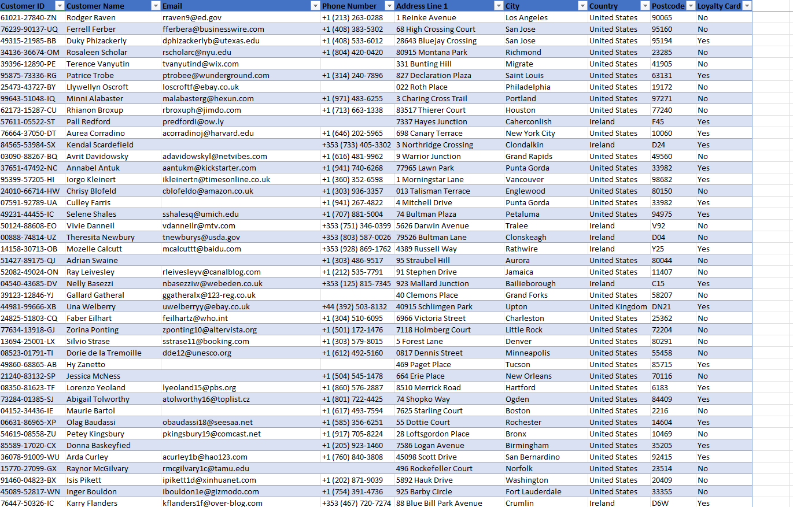
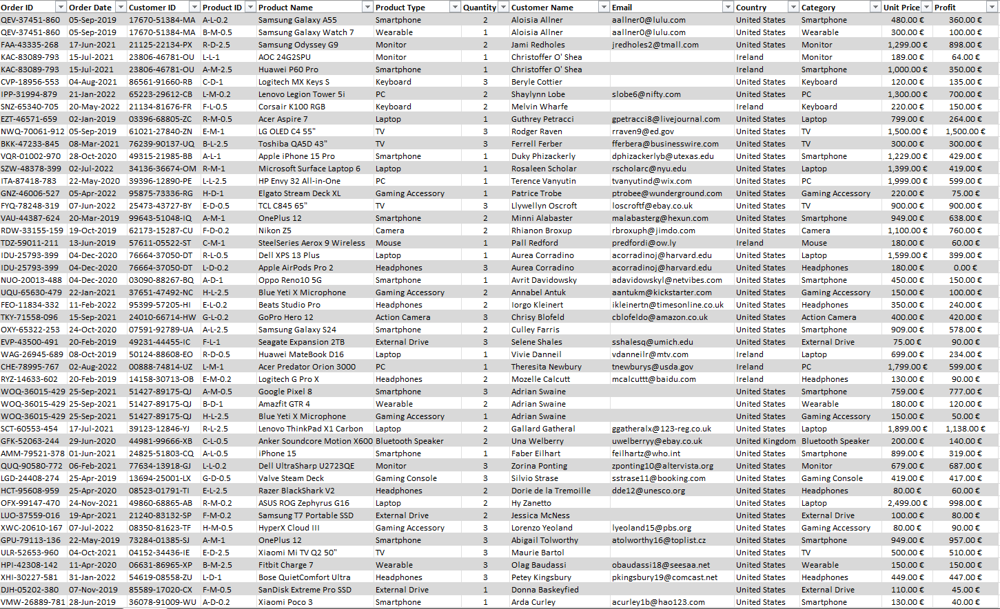
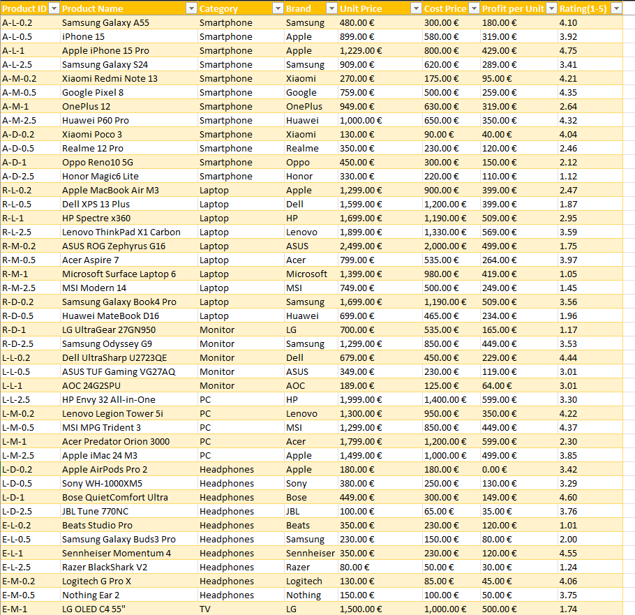
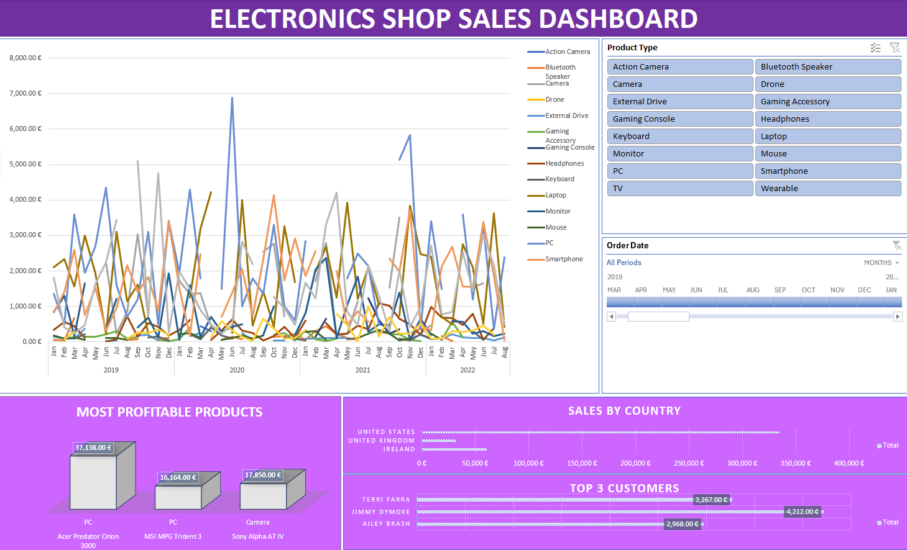
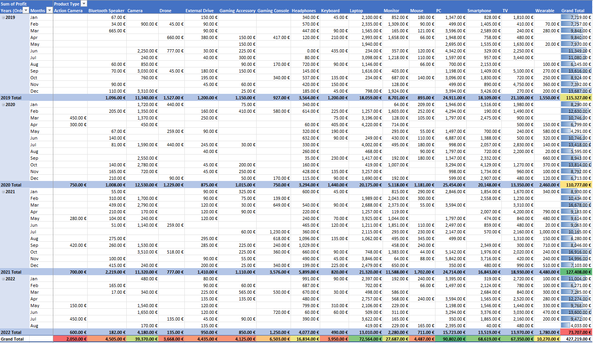

  

<h1 align="center">📊 Excel Sales Dashboard Project 📊</h1>

An interactive Excel-based dashboard for sales and profit analytics, built using Pivot Tables, Charts, and Data Visualization techniques.

---

# 📊 Sales Dashboard Project (Excel)

## Overview
This project is an interactive **Sales Dashboard** built in **Microsoft Excel**.  
It provides key insights into company sales performance using visual analytics and structured data management.  

The project simulates a business environment, where data is collected, processed, and visualized to support data-driven decision-making.  

---

## 📁 Project Structure
The Excel workbook contains the following sheets:

- **Customers** → Contains customer information such as ID, name, location, and segment.  
- **Orders** → Includes all sales transactions, dates, quantities, and order IDs.  
- **Products** → Lists product details including category, sub-category, and unit price.  
- **Profit_Table** → Calculates profit metrics, margins, and total revenue per product or region.  
- **Sales_Dashboard** → An interactive dashboard with charts, KPIs, and slicers for filtering data dynamically.  

---

## 🎯 Objectives
- Create a clear and interactive dashboard to analyze sales performance.  
- Enable quick insights into **total revenue, profit trends, top customers, and best-selling products**.  
- Demonstrate data cleaning, transformation, and visualization skills in Excel.  

---

## ⚙️ Tools & Techniques Used
- **Microsoft Excel**
  - Pivot Tables & Pivot Charts  
  - Slicers and Timelines for interactivity  
  - Conditional Formatting  
  - Data Validation  
  - Profit calculations and formulas  
- **Data Management & Analytics Concepts**
  - Data cleaning and organization  
  - KPI tracking  
  - Performance metrics visualization  

---

## 📈 Key Insights
- Identify which products generate the highest profit margins.  
- Compare sales trends across time periods and regions.  
- Understand customer segmentation and order behavior.  
- Monitor key business metrics at a glance using visual dashboards.  

---

## 🧠 Skills Demonstrated
- Data Analysis  
- Dashboard Design  
- Business Intelligence (BI) Concepts  
- Data Visualization  
- Microsoft Excel Automation  

---

## 🧩 How to Use
1. Open the Excel file: `Electronics_Shop_Sales_Dashboard.xlsx`  
2. Explore each sheet (Customers, Orders, Products, Profit_Table).  
3. Go to the **Sales Dashboard** tab to interact with the visual analytics.  
4. Use slicers and filters to customize the data view.  

## 📂 Raw Data Samples

### Customers

  

### Orders

  

### Products

  

### Dashboard Overview
The interactive dashboard summarizes key performance indicators (KPIs) such as **Total Sales**, **Total Profit**, **Profit Margin**, and **Top Products**.  
It allows dynamic filtering by **product category, region, and time period** using slicers.

  

### Sales Table
The Sales Table aggregates all transactions and profits, giving a detailed view of **sales performance per order and product**.  
It helps identify trends and high-performing products.

  

 

> Note: Each table contains ~1000 entries; screenshots show only the first 30–50 rows.

